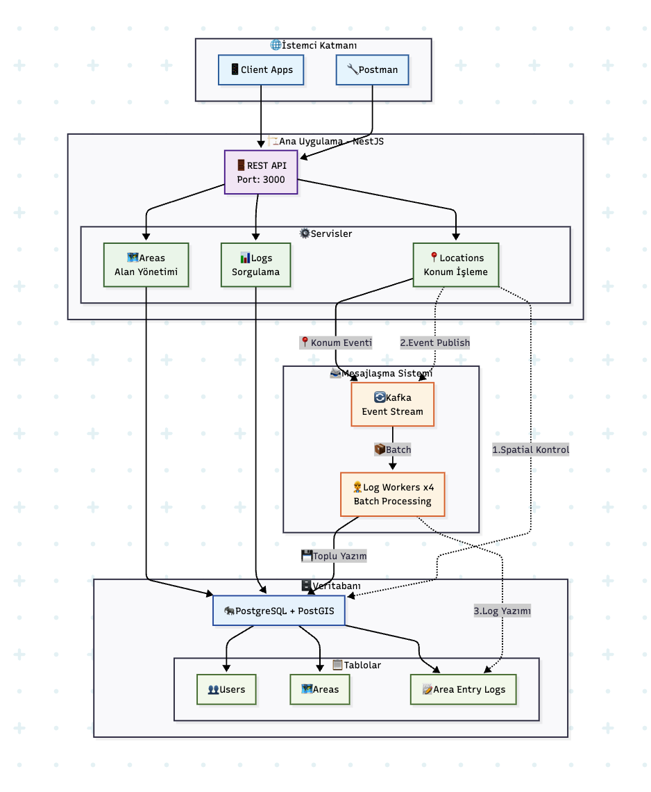

# Location Log API

Kullanıcı konum **(enlem-boylam)** bazlı coğrafi alan giriş kontrolü & loglama API.

## 📑 İçindekiler

- [Proje Açıklaması](#proje-açıklaması)
- [Sistem Mimarisi](#-sistem-mimarisi)
- [Özellikler](#-özellikler)
- [Teknolojiler](#️-teknolojiler)
- [Geliştirme Notları](#-geliştirme-notları)
- [Proje Yapısı](#-proje-yapısı)
- [API Endpoint'leri](#-api-endpointleri)
- [Postman Collection](#-postman-collection)
- [Docker Servisleri](#-docker-servisleri)
- [Kurulum ve Çalıştırma](#-kurulum-ve-çalıştırma)

## Proje Açıklaması

Bu proje, kullanıcıların belirli coğrafi alanlara giriş hareketlerini loglayan bir sistemdir. NestJS, PostgreSQL/PostGIS, Prisma, Kafka ve Docker kullanılarak sistemin performans odağında bir case çalışması olarak geliştirilmiştir.

## 🏗️ Sistem Mimarisi



- **🌐 İstemci Katmanı**: Mobil/Web uygulamalar ve test araçları
- **🏗️ Ana Uygulama**: NestJS tabanlı REST API servisi
- **📨 Mesajlaşma Sistemi**: Kafka ile event-driven asenkron işleme
- **🗄️ Veritabanı**: PostgreSQL + PostGIS ile spatial veri yönetimi

**🔄 Veri Akışı**: Konum verisi gelir → Spatial kontrol → Kafka event → Asenkron log yazımı

### 🚀 Özellikler

- **Coğrafi Alan Yönetimi**: Polygon koordinatları ile coğrafi alanlar tanımlama
- **Konum İşleme**: Kullanıcı konumlarını girdiği alanlar üzerinde olarak işleme
- **Event-Driven Architecture**: Kafka ile asenkron mesajlaşma
- **Performanslı Sorgulama**: Sayfalandırma ve filtreleme desteği
- **Ölçeklenebilir Mimari**: Worker & Kafka Partioning tabanlı yapı
- **PostGIS Desteği**: Jeospatial veri işleme

## 🛠️ Teknolojiler

- **NestJS**: Backend framework
- **PostgreSQL + PostGIS**: Veritabanı ve jeospatial işlemler
- **Prisma**: ORM ve veritabanı yönetimi
- **Apache Kafka**: Event streaming ve mesajlaşma
- **Docker**: Konteynerleştirme ve orkestrasyon

## 🔧 Geliştirme Notları

- **Kafka Partitioning**: UserId bazlı partition dağılımı
- **PostGIS**: ST_Contains fonksiyonu ile polygon-point kontrolü
- **Event-Driven**: Konum işleme asenkron olarak Kafka üzerinden

## 📁 Proje Yapısı

```
src/
├── areas/              # Coğrafi alan yönetimi
├── area-entry-logs/    # Log sorgulama modülü
├── locations/          # Konum işleme modülü
├── log-worker/         # Kafka consumer worker
├── database/           # Prisma veritabanı servisi
├── kafka/              # Kafka producer/consumer
├── utils/              # Yardımcı fonksiyonlar
└── main.ts            # Ana uygulama entry point

docs/
└── postman-collection.json  # API test collection'ı

prisma/
├── schema.prisma      # Veritabanı şeması
├── seed.ts           # Test verisi
└── migrations/       # Veritabanı migration'ları
```

## 📋 API Endpoint'leri

### Areas (Coğrafi Alanlar)

- `POST /areas` - Yeni alan oluştur
- `GET /areas` - Tüm alanları listele
- `GET /areas/:id` - Belirli bir alanı getir
- `PATCH /areas/:id` - Alan güncelle
- `DELETE /areas/:id` - Alan sil

### Locations (Konum İşleme)

- `POST /locations` - Kullanıcı konumunu işle.

### Logs (Alan Giriş Logları)

- `GET /logs` - Logları listele (sayfalandırma ve filtreleme ile)

## 📚 Postman Collection

API endpoint'lerini test etmek için hazır Postman collection'ı kullanabilirsiniz:

1. `docs/postman-collection.json` dosyasını Postman'e import edin
2. Environment değişkenleri otomatik olarak gelecektir
3. Tüm endpoint'leri örnek verilerle test edebilirsiniz

**💡 Hızlı Test İpucu:** Kurulum adımlarında 4. aşamadaki seed verilerini yüklemeyi unutmayın! Bu sayede collection'daki environment değişkenleri gerçek verilerle çalışacak ve direkt test etmeye başlayabilirsiniz.

## 🐳 Docker Servisleri

Proje aşağıdaki Docker servislerini içerir:

- **app**: Ana NestJS uygulaması (Port: 3000)
- **log-worker**: Kafka consumer worker
- **postgres**: PostgreSQL + PostGIS (Port: 5432)
- **kafka**: Apache Kafka (Port: 9092)
- **zookeeper**: Kafka Zookeeper (Port: 2181)

## 🚀 Kurulum ve Çalıştırma

### Gereksinimler

- **Docker** ve **Docker Compose**
- Git

### Kurulum Adımları

1. **Projeyi klonlayın**

```bash
git clone <repository-url>
cd location-log-api
```

2. **Environment dosyasını hazırlayın**

```bash
cp .env.example .env
# Varsayılan ayarlar Docker için optimize edilmiştir
```

3. **Tüm servisleri Docker ile başlatın**

```bash
# Tüm servisleri arka planda başlat (ilk çalıştırmada image'lar indirilecek)
docker-compose up -d

# Servislerin ayağa kalkmasını bekleyin (yaklaşık 30-60 saniye)
docker-compose logs -f app

# CTRL+C ile çıkış yapın
```

4. **Veritabanı migration ve seed işlemleri**

```bash
# Migration'ları çalıştır
docker-compose exec app npm run db:migrate:deploy

# Test verilerini yükle
docker-compose exec app npm run db:seed
```

5. **API'yi test edin**

```bash
# Alanları listele
curl http://localhost:3000/areas
```

### 🔍 Servis Durumunu Kontrol Etme

```bash
# Tüm servislerin durumunu görüntüle
docker-compose ps

# Logları takip et
docker-compose logs -f

# Belirli bir servisin loglarını izle
docker-compose logs -f app
docker-compose logs -f kafka
```

### 🧹 Temizlik İşlemleri

```bash
# Servisleri durdur
docker-compose down

# Veritabanını da sıfırla (volume'ları sil)
docker-compose down -v

# Tüm container'ları ve image'ları temizle
docker-compose down --rmi all -v
```
